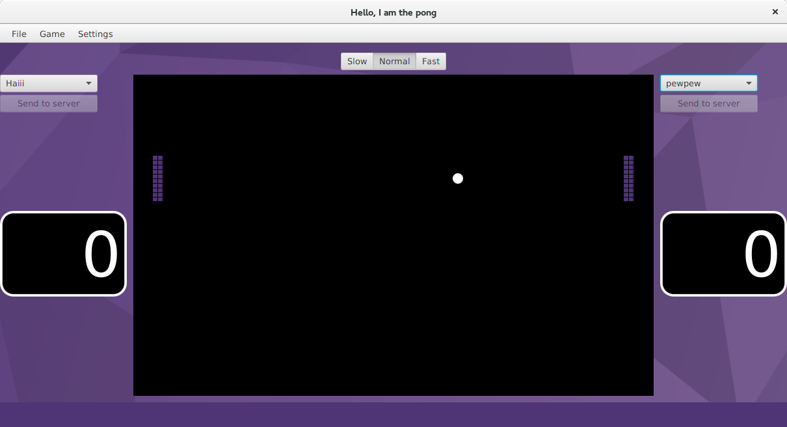

Robopong
========

Like RoboCode, but with Pong instead of tanks.

Requires Java 8 and JavaFX.



## Goal
In Robopong you programmatically play Pong. That is, you write code that decides how the paddle behaves and then sit back and watch while it plays against another paddle.

## A very simple paddle
```java
import se.purplescout.pong.game.GameRound;
import se.purplescout.pong.game.Paddle;

public class TopLoader extends Paddle {

  @Override
  public void decideWhatToDoThisTick(GameRound context) {
    // This method is invoked once each tick, or roughly 40 times
    // per second.

    // The value given to ploxxMoveMyCenterTo is basically what
    // this game is about. You need to write code that calculates
    // where the paddle should go.

    // Just move the paddle as high as possible
    ploxxMoveMyCenterTo(0);
  }

  @Override
  public String getTeamName() {
    return "TopLoader";
  }
}

```

### API
By inheriting from `se.purplescout.pong.game.Paddle` you get access to the following API.

```java
/**
 * Invoked several times per second, just before the paddle is to move. Don't put your heavy lifting here.
 *
 * @param context Information about the game round before anything moves
 */
public abstract void decideWhatToDoThisTick(GameRound context);

/**
 * @return A string that will be used to identify your paddle
 */
public abstract String getTeamName();

/**
 * @return A copy of the rectangle representing the paddle. X and Y are
 * absolute positions.
 */
public final Rectangle getBoundingBox()

/**
 * @return The paddle's velocity vector. (3,5) means that the paddle travels
 * 3 pixels to the right and 5 pixels down each tick. (-3, -5) means that
 * the paddle travels 3 pixels to the left and 5 pixels up each tick. The
 * x value is always zero
 */
public final Vector getMovementVector()

/**
 * Invoked when you want to move the paddle. (0,0) is the top left corner of
 * the game board.
 *
 * The paddle can only move a short distance every tick. If the position you
 * ploxx move to is further away than this short distance the paddle will
 * continue the movement next tick.
 *
 * @param y The y-coordinate you want your paddle's center at
 */
public final void ploxxMoveMyCenterTo(double y)

/**
 * @return True if the paddle is not at it's ploxx pos.
 */
public final boolean willMoveThisTick()
```

## Ways to play

### Local
If you and a group of friends want to sit down together and play you need to run the LAN server on one computer. Everyone needs to know the address and be able to connect to this computer.

1. Compile and run the LANServer module on the computer that acts as the server
2. Compile and distribute the jar file from the Client module to everyone who wants to play.

### Web
If you want a long running competition you have the option to let contestants upload their paddles over HTTP. What what now? Upload code over HTTP and then just blindly execute it? Yeah, I've tried to make it at least non-trivial to do bad things but I'm just an amateur. I suggest you run this in an environment where it doesn't matter if it gets destroyed or used maliciously.

1. Compile and run the WebServer module on the server
2. Compile and distribute the jar file from the Client module to everyone who wants to play. The players then uploads their source file to the web server. A very basic upload form is served by the `/upload` GET endpoint.

## Compiling and running
These instructions where written using Gradle 2.2.1.

### Compiling the client
This requires JavaFX, and thus Oracle JDK 8

From the git root
```
$ cd Client
$ gradle jar
```

It can then be started by
```
$ java -jar build/libs/Client-1.0.jar
```
### Compiling the LAN server
This requires JavaFX, and thus Oracle JDK 8

From the git root
```
$ cd LANServer
$ gradle jar
```

It can then be started by
```
$ java -jar build/libs/LANServer-1.0.jar
```

### Compiling the web server
This requires JavaFX, and thus Oracle JDK 8

From the git root
```
$ cd WebServer
$ gradle jar
```

It can then be started by
```
$ java -jar build/libs/WebServer-1.0.jar
```

Then surf to http://localhost:1337 to see what the web server can do.
